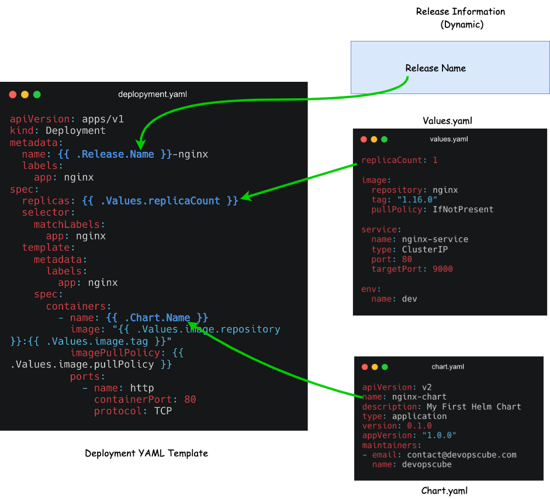

# Helm Tutorial

## What is Helm Chart?

For the purpose of explanation, I am choosing a very basic example of a website frontend deployment using Nginx on Kubernetes

Let’s assume you have four different environments in your project. Dev, QA, Staging, and Prod. Each environment will have different parameters for Nginx deployment. For example,

In Dev and QA you might need only one replica.
In staging and production, you will have more replicas with pod autoscaling.
The ingress routing rules will be different in each environment.
The config and secrets will be different for each environment.
Because of the change in configs and deployment parameters for each environment, you need to maintain different Nginx deployment files for each environment. Or you will have a single deployment file and you will need to write custom shell or python scripts to replace values based on the environment. However, it is not a scalable approach. Here is where the helm chart comes into the picture.

Helm charts are a combination of Kubernetes YAML manifest templates and helm-specific files. You can call it a helm package. Since the Kubernetes YAML manifest can be templated, you don’t have to maintain multiple helm charts of different environments. Helm uses the go templating engine for the templating functionality.

You just need to have a single helm chart and you can modify the deployment parameters of each environment by just changing a single values file. Helm will take care of applying the values to the templates. We will learn more about it practically in the next sections.

At a high level, Helm Charts reduce the complexity, and kubernetes manifest redundancy of each environment (dev, uat, cug, prod) with only one template.

## Helm Chart Structure

To understand the Helm chart, let’s take an example of Nginx deployment. To deploy Nginx on Kubernetes, typically you would have the following YAML files.

```text
    nginx-deployment
        ├── configmap.yaml
        ├── deployment.yaml
        ├── ingress.yaml
        └── service.yaml
```

Now if we create a Helm Chart for the above Nginx deployment, it will have the following directory structure.

`helm create nginx-chart`

```text
nginx-chart/
|-- Chart.yaml
|-- charts
|-- templates
|   |-- NOTES.txt
|   |-- _helpers.tpl
|   |-- deployment.yaml
|   |-- configmap.yaml
|   |-- ingress.yaml
|   |-- service.yaml
|   `-- tests
|`-- test-connection.yaml
`-- values.yaml
```

As you can see, the deployment YAML files are part of the template directory (highlighted in bold) and there are helm-specific files and folders. Let’s look at each file and directory inside a helm chart and understand its importance.

.helmignore: It is used to define all the files that we don’t want to include in the helm chart. It works similarly to the .gitignore file.

Chart.yaml: It contains information about the helm chart like version, name, description, etc.

```markdown
    apiVersion: This denotes the chart API version. v2 is for Helm 3 and v1 is for previous versions.
    name: Denotes the name of the chart.
    description: Denotes the description of the helm chart.
    Type: The chart type can be either ‘application’ or ‘library’. Application charts are what you deploy on Kubernetes. Library charts are re-usable charts that can be used with other charts. A similar concept of libraries in programming.
    Version: This denotes the chart version. 
    appVersion: This denotes the version number of our application (Nginx). 
    maintainers: Information about the owner of the chart.
    We should increment the version and appVersion each time we make changes to the application. There are some other fields like dependencies, icons, etc. 
```

We should increment the version and appVersion each time we make changes to the application. There are some other fields like dependencies, icons, etc.

**values.yaml**: In this file, we define the values for the YAML templates. For example, image name, replica count, HPA values, etc. As we explained earlier only the values.yaml file changes in each environment. Also, you can override these values dynamically or at the time of installing the chart using --values or --set command.

charts: We can add another chart’s structure inside this directory if our main charts have some dependency on others. By default this directory is empty.

templates: This directory contains all the Kubernetes manifest files that form an application. These manifest files can be templated to access values from values.yaml file. Helm creates some default templates for Kubernetes objects like deployment.yaml, service.yaml etc, which we can use directly, modify, or override with our files.

templates/NOTES.txt: This is a plaintext file that gets printed out after the chart is successfully deployed.

templates/_helpers.tpl: That file contains several methods and sub-template. These files are not rendered to Kubernetes object definitions but are available everywhere within other chart templates for use.

templates/tests/: We can define tests in our charts to validate that your chart works as expected when it is installed.

The idea of a helm chart is to template the YAML files so that we can reuse them in multiple environments by dynamically assigning values to them.

To template a value, all you need to do is add the object parameter inside curly braces as shown below. It is called a template directive and the syntax is specific to the Go templating

`{{ .Object.Parameter }}`

Let’s understand what is an Object. Following are the three Objects we are going to use in this example.

Release: Every helm chart will be deployed with a release name. If you want to use the release name or access release-related dynamic values inside the template, you can use the release object.
Chart: If you want to use any values you mentioned in the chart.yaml, you can use the chart object.
Values: All parameters inside values.yaml file can be accessed using the Values object.

To know more about supported Objects check the [Helm Builtin Object](https://helm.sh/docs/chart_template_guide/builtin_objects/) document.

The  shows how the built-in objects are getting substituted inside a template.

First, you need to figure out what values could change or what you want to templatize. I am choosing name, replicas, container name, image, imagePullPolicy and configMap Name which I have highlighted in the YAML file in bold.

name: name: {{ .Release.Name }}-nginx : We need to change the deployment name every time as Helm does not allow us to install releases with the same name. So we will templatize the name of the deployment with the release name and interpolate -nginx along with it. Now if we create a release using the name frontend, the deployment name will be frontend-nginx. This way, we will have guaranteed unique names.
container name: {{ .Chart.Name }}: For the container name, we will use the Chart object and use the chart name from the chart.yaml as the container name.
Replicas: {{ .Values.replicaCount }} We will access the replica value from the values.yaml file.
image: "{{ .Values.image.repository }}:{{ .Values.image.tag }}" Here we are using multiple template directives in a single line and accessing the repository and tag information under the image key from the Values file.
configMap Name: {{ .Release.Name }}-index-html-configmap. Here we are adding the release name to the configmap.

In the protocol template directive, you can see a pipe ( | ) . It is used to define the default value of the protocol as TCP. It means,if we won’t define the protocol value in values.yaml file or if it is empty, it will take TCP as a default value for protocol.

Create a configmap.yaml and add the following contents to it. Here we are replacing the default Nginx index.html page with a custom HTML page. Also, we added a template directive to replace the environment name in HTML.

Now we have the Nginx helm chart ready and the final helm chart structure looks like the following.

nginx-chart
├── Chart.yaml
├── charts
├── templates
│   ├── configmap.yaml
│   ├── deployment.yaml
│   └── service.yaml
└── values.yaml

Validate the Helm Chart
Now to make sure that our chart is valid and, all the indentations are fine, we can run the below command. Ensure you are inside the chart directory.

`helm lint .`
If you are executing it from outside the nginx-chart directory, provide the full path of nginx-chart

`helm lint /path/to/nginx-chart`
If there is no error or issue, it will show this result

```==> Linting ./nginx
[INFO] Chart.yaml: icon is recommended```

1 chart(s) linted, 0 chart(s) failed
To validate if the values are getting substituted in the templates, you can render the templated YAML files with the values using the following command. It will generate and display all the manifest files with the substituted values.

`helm template .`
We can also use --dry-run command to check. This will pretend to install the chart to the cluster and if there is some issue it will show the error.

`helm install --dry-run my-release nginx-chart`
If everything is good, then you will see the manifest output that would get deployed into the cluster.


## Deploy the Helm Chart
When you deploy the chart, Helm will read the chart and configuration values from the values.yaml file and generate the manifest files. Then it will send these files to the Kubernetes API server, and Kubernetes will create the requested resources in the cluster.

Now we are ready to install the chart.

Make sure to run the Helm commands from a directory outside the helm-chart folder.

Execute the following command where frontend is release name and nginx-chart is the chart name. It installs nginx-chart in the default namespace

helm install frontend nginx-chart
NAME: frontend
LAST DEPLOYED: Wed Jun 19 11:12:20 2024
NAMESPACE: default
STATUS: deployed
REVISION: 1
TEST SUITE: None
Now you can check the release list using this command: You can also use ls instead of list

helm list
Run the kubectl commands to check the deployment, services, and pods.

kubectl get deployment
kubectl get services
kubectl get configmap
kubectl get pods

We can see the deployment frontend-nginx, nginx-service and pods are up and running as shown below.

We discussed how a single helm chart can be used for multiple environments using different values.yaml files. To install a helm chart with an external values.yaml file, you can use the following command with the --values flag and path of the values file.

helm install frontend nginx-chart --values env/prod-values.yaml
When you have Helm as part of your CI/CD pipeline, you can write custom logic to pass the required values file depending on the environment.

Helm Upgrade & Rollback
Now suppose you want to modify the chart and install the updated version, we can use the below command:

helm upgrade frontend nginx-chart
For example, we have changed the replicas from 2 to 1. You can see the revision number is 2 and only 1 pod is running.

helm chart upgrade
Now if we want to roll back the changes that we have just done and deploy the previous one again, we can use the rollback command to do that.

helm rollback frontend
The above command will roll back the helm release to the previous one.

helm chart rollback
After the rollback, we can see 2 pods are running again. Note that Helm takes the rollback as a new revision, that’s why we’re getting the revision as 3.

If we want to roll back to the specific version we can put the revision number like this.

helm rollback <release-name> <revision-number>
For example,

helm rollback frontend 2
Uninstall The Helm Release
To uninstall the helm release use uninstall command. It will remove all of the resources associated with the last release of the chart.

helm uninstall frontend
If you have deployed the release in a specific namespace, you can pass the namespace flag with the uninstall command as given below.

helm uninstall <release-name> --namespace <namespace>
Package the Helm Chart
We can package the chart and deploy it to Github, S3, or any chart repository.

Execute the following command to package the nginx-chart.

helm package chart-name/
For example,

helm package nginx-chart

Successfully packaged chart and saved it to: /home/vagrant/helm-tutorial/nginx-chart-0.1.0.tgz
When you package it, it follows semver 2 version guidelines.

Debugging Helm Charts
We can use the following commands to debug the helm charts and templates.

helm lint: This command takes a path to a chart and runs a series of tests to verify that the chart is well-formed.
helm get values: This command will output the release values installed to the cluster.
helm install --dry-run: Using this function we can check all the resource manifests and ensure that all the templates are working fine.
helm get manifest: This command will output the manifests that are running in the cluster.
helm diff: It will output the differences between the two revisions.
helm diff revision nginx-chart 1 2
Helm Chart Possible Errors
If you try to install an existing Helm package, you will get the following error.

Error: INSTALLATION FAILED: cannot re-use a name that is still in use
To update or upgrade the release, you need to run the upgrade command.

If you try to install a chart from a different location without giving the absolute path of the chart you will get the following error.

Error: non-absolute URLs should be in form of repo_name/path_to_chart
To rectify this, you should execute the helm command from the directory where you have the chart or provide the absolute path or relative path of the chart directory.

## Helm Charts Best Practices
Following are some of the best practices to be followed when developing a helm chart.

Document your chart by adding comments and a README file as documentation is essential for ensuring maintainable Helm charts.
We should name the Kubernetes manifest files after the Kind of object i.e. deployment, service, secret, ingress, etc.
Put the chart name in lowercase only and if it has more than a word then separate out with hyphens (-)
In values.yaml file field name should be in lowercase.
Always wrap the string values between quote signs.
Use Helm version 3 for simpler and more secure releases. Check this document for more details
Helm Commands Summary (Cheat Sheet)

Here’s a quick reference list of common Helm commands you can use in your day-to-day workflow:

helm install
Installs a Helm chart onto your Kubernetes cluster.

helm install <release-name> <chart-path-or-name>
helm upgrade
Updates your existing Helm release with new chart changes or updated values.

helm upgrade <release-name> <chart-path-or-name>
helm rollback
Rolls back a Helm release to a previous revision.

helm rollback <release-name> <revision-number>
helm test
Runs the tests defined in the Helm chart’s templates/tests directory against your release.

helm test <release-name>
helm lint
Checks a chart for possible issues like formatting or missing fields.

helm lint <chart-directory>
helm template
Renders a chart to show the Kubernetes manifests without installing them. Useful for debugging your templates.

helm template <chart-directory>
helm list (helm ls)
Lists all the currently installed releases in the specified namespace (defaults to the current namespace).

helm list
helm uninstall
Uninstalls a Helm release, removing all the associated Kubernetes resources from your cluster.

helm uninstall <release-name>

[Source](https://devopscube.com/create-helm-chart/)